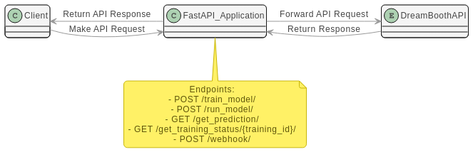

# FastAPI-based DreamBooth API

## Description

This API is built using FastAPI and is designed to integrate with DreamBooth's AI models. It provides various endpoints for model training, running models, and querying their status.

---

## Table of Contents

- [Setup](#setup)
- [Usage](#usage)
  - [Training a Model](#training-a-model)
  - [Running a Model](#running-a-model)
  - [Get Prediction](#get-prediction)
  - [Get Training Status](#get-training-status)
  - [Webhook](#webhook)
- [API Endpoints](#api-endpoints)
- [Dependencies](#dependencies)

---

## Setup

1. Install FastAPI and other dependencies.
2. Set your `REPLICATE_TOKEN` and `WEBHOOK_URL` as env variables.
3. Optionally set DOCS_PASSWORD and DOCS_USERNAME for the fastapi docs page.
4. DD_AGENT_HOST, DD_TRACE_AGENT_PORT and DATADOG_SERVICE_NAME to configure datadog.
5. Set API_KEY to change api key for the endpoints.

---

## Usage

### Training a Model

#### Endpoint: POST `/train_model/`

Train a model by providing instance and class prompts, the maximum number of training steps, the model version, and the trainer version.

#### Required Fields:

- `instance_prompt` (str)
- `class_prompt` (str)
- `max_train_steps` (int)
- `model` (str)
- `trainer_version` (str)
- `file` (UploadFile) - Zip file for training data

### Running a Model

#### Endpoint: POST `/run_model/`

Run an already trained model.

#### Required Fields:

- `RunInput` - The input parameters to run the model. It is a Pydantic model.
- `version` (str) - The version of the model to run.

### Get Prediction

#### Endpoint: GET `/get_prediction/`

Get the prediction result from a given URL.

#### Parameters:

- `url` (str) - The URL to fetch the prediction from.

### Get Training Status

#### Endpoint: GET `/get_training_status/{training_id}/`

Get the current status of a training operation using its training ID.

#### Parameters:

- `training_id` (str) - ID of the training operation

### Webhook

#### Endpoint: POST `/webhook/`

This endpoint receives payload data related to model training.

---

## API Endpoints

- `POST /train_model/`
- `POST /run_model/`
- `GET /get_prediction/`
- `GET /get_training_status/{training_id}/`
- `POST /webhook/`

---

## Dependencies

- FastAPI
- DreamBoothAPI
- pydantic

---

## Diagram

